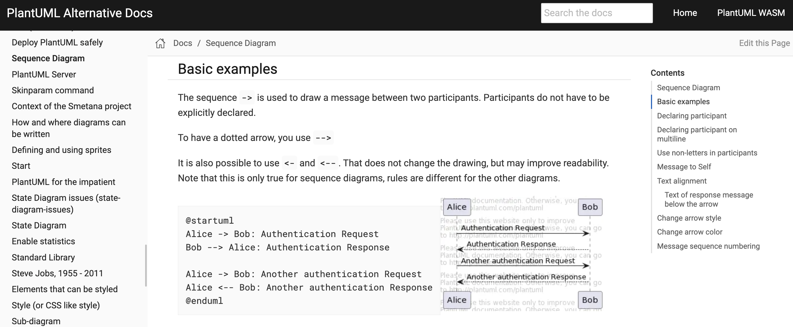

= PlantUML Alternative Docs

PlantUML alternative docs for better readability using the alphadocs as a source.

== Features

- Better navigation, top for chapters, left for topics, right for subtopics

- Lunr search engine

- Better layout for docs based on Antora

- Automated sync from link:http://alphadoc.plantuml.com[alphadoc]

- Static pages, can be served on Github Pages or any CDN

- Edit link taking to dokuwiki

- Lazy loading diagrams

- Clicking the diagram takes diagram editing

== Antora structure

- We have antora-playbook.yml that defines our site.

- Our site uses only one component called docs.

- docs component's pages are automatically generated in a PR after processing the docs_from_alphadoc. It shouldn't be edited manually.

- Navigation is NOT generated automatically on purpose, it needs to be edited for the best convinence.

- Site is built and pushed into gh-pages branch when a new commit is merged to main.

== Updating the docs from alphadoc

This project uses link:http://alphadoc.plantuml.com/toc/asciidoc/en[PlantUML's alphadoc] as a source of truth.

To fetch the latest docs from alphadoc, `sync-docs` workflow should be manually triggered by
 going to the link:../../../actions/workflows/sync-docs.yml[actions page] or calling it via API.
It automatically creates a PR with the updated docs.
